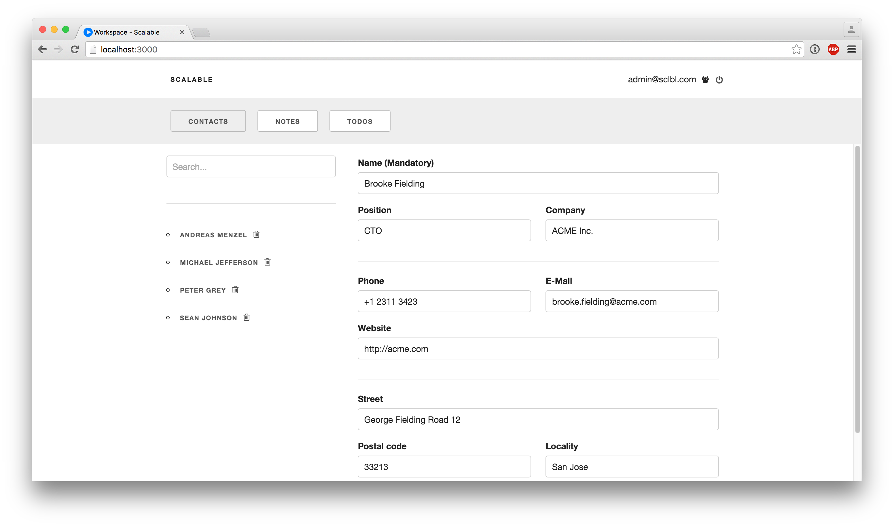

# Scalable
Scalable is a modular business software solution.

In Scalable you can add / remove so called modules which provide business related functionality such as:

- CRM
- Contacts
- Todos
- Notes
- Calendar
- ...

Modules run as loosely coupled microservices.

By adding only the modules you need / develop your own modules you can compose the business software you always wanted.

## Setup
Fill out all the necessary information in settings.json and run the application on a free port:

e.g. `meteor --settings settings.json --port 3000`

An admin user will be created with the following credentials:

E-Mail: admin@sclbl.com

Password: 12345678

**Note: Change the password as soon as possible!**

After that pick a module (e.g. the [Todos module](http://github.com/sclbl/scalable-todos)) and run this module separately on another port.
It will register itself as a Scalable module and should be visible in the workspace after a few seconds.

## Contribution
We highly welcome any kind of contribution. Just open up an issue or send a pull request.
